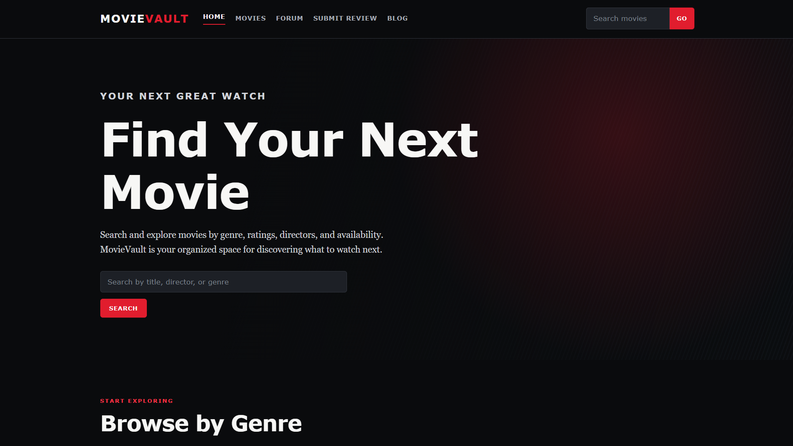
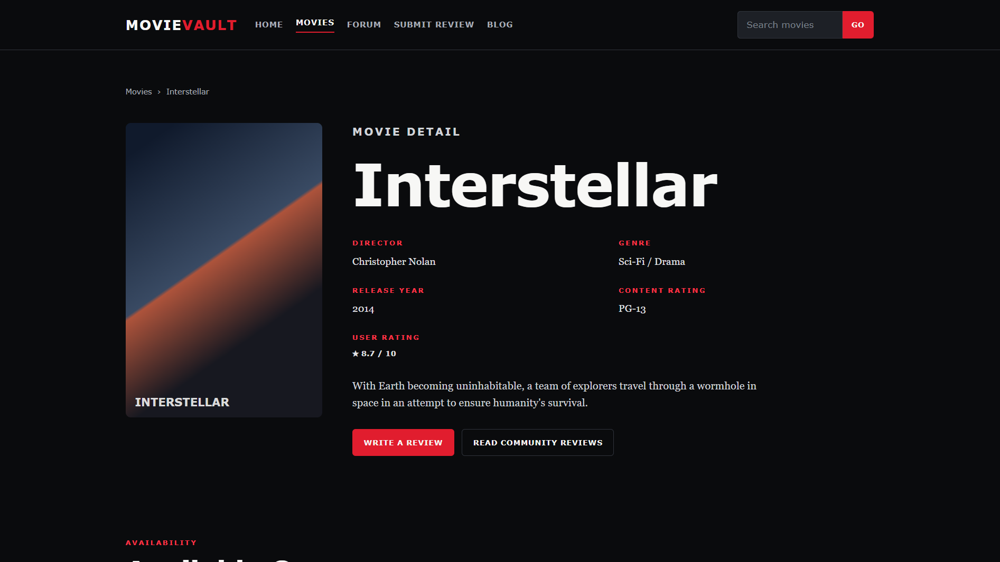
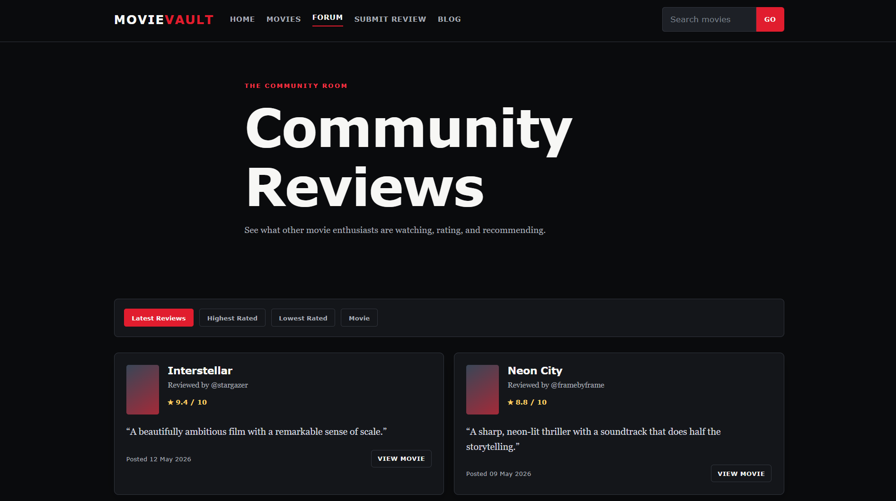
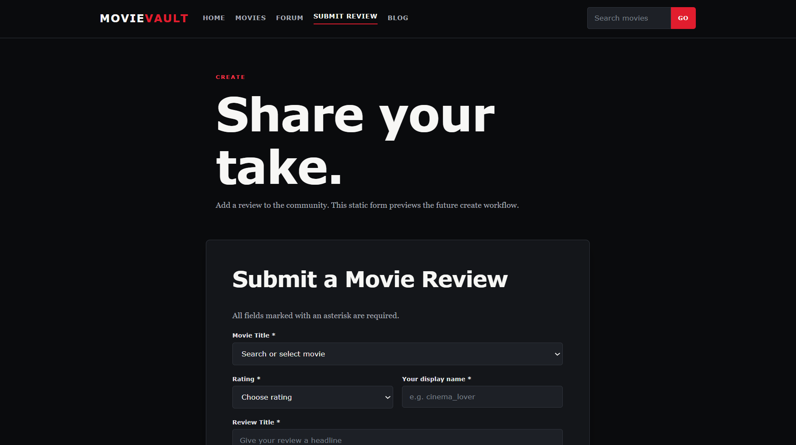
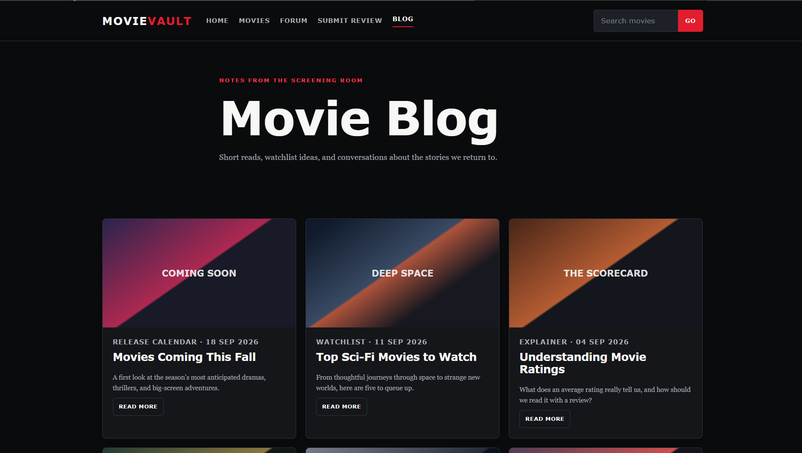

Milestone: M02 9/16/26

## M02 Reflection 

1. 
```
    <header>
      <p>Movie Manager · Movie Enthuists</p>
    </header>
 
    <section class="cards" aria-label="Proposed screens">
        <article class="card">
          <h2>Search for movies</h2>
          <p>Sketch the search bar, filters, and result list.</p>
        </article>
        <article class="card">
          <h2>Mark a movie as favorite</h2>
          <p>Sketch the favorite button and its visual feedback.</p>
        </article>
        <article class="card">
          <h2>Answer a question</h2>
          <p>Sketch the question and the expected answer.</p>
        </article>
      </section>
```

2. 
```
What I found from this lesson on the S Corp site today is a better understanding for HTML. I am already comfortable and familiar with HTML and CSS, but do not fully understand *Looping* (ex.  ...  ) and *Values* (ex. {{ claim.incurred|money }}). I understand the formatting better, but still do not fully understand how it accesses this information from the database.
```

3. 
```
During the lab, I set a Github Repository for this project and organized the files inside. I did this to better organize the project as well as be able to access it from different computers.
```

4. 
```
A problem that needs my attention is the complexity and navigation through the project. I need to visualize how it will operate and create a skeleton.md file in which I will create the first version of the UI.
```

5. 
```
My next action is to sketch a navigation system, then design the pages. 
```

## M02 HTML Page and Structure

```
Brief draft of UI design.





```

```
Mapping of the Database - UI

The fields shown on the movie page will later be supplied by the database. The movie title, release date, and content rating will come from the `movies` table. The genre will come from the `genres` table, and the director will come from the `directors` table. User ratings and review information will come from the `reviews` table, which will be connected to the correct movie using the `movie_id` foreign key. Streaming availability may later come from the `StreamingServices` and `MovieStreaming` tables.
```

```
Jinja Set up brief explination

Jinja will run on the server later to insert information retrieved from the database into the HTML templates before the completed HTML is sent to the user's browser.
```

AI Use: I used ChatGPT and Astra to assist with planning, generating, and organizing the initial HTML/CSS structure. I reviewed and modified the generated code to ensure it matched my project requirements.