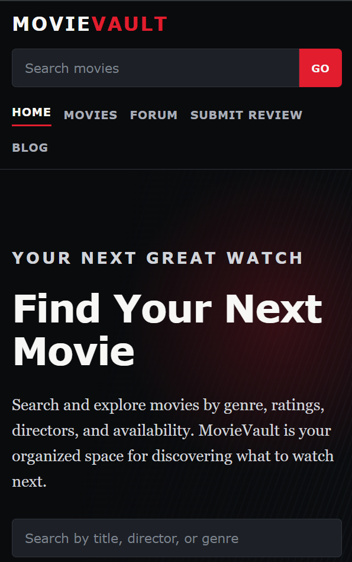

## MileStone M03 / Date: 9/23/26

Activity Questions

1. The width or max-width property limits how wide the main content can become. The margin helps position or center the content, while the padding adds space inside the main area so the content does not sit directly against the page edges.

2. I updated the --ink, --paper, and --brand color variables in brand.css and confirmed that the page elements using those variables changed as expected. I also adjusted the .card padding to improve spacing and readability. After saving and refreshing mockup.html, the intended colors and card spacing were applied correctly.

3. I tested the page at a 375px responsive width and at 200% browser zoom. The heading, labels, links, and input controls remained visible, readable, and usable, and I was able to tab through the interactive elements without losing access to them. After testing, I restored the browser zoom to 100%.

4. I used Inspect to identify that the .card padding was making the content feel too crowded. I increased the padding value in brand.css to add more space between the card edges and its text and controls. This made the content easier to read and prevented the elements from feeling cramped. I saved before-and-after screenshots to show the improvement.

## M03 Reflection
1. One CSS rule I inspected and changed was the `.card` padding in `brand.css`. I increased the padding to create more space between the card edges and the content. This made the cards easier to read and less crowded.

2. While testing the page at a 375px width and 200% zoom, I checked the headings, labels, links, inputs, and keyboard navigation. I did not find any major usability problems because everything remained visible and usable. I plan to continue testing as I add more content to make sure the layout stays responsive.

3. During the lab, I updated the `--ink`, `--paper`, and `--brand` color variables in my CSS and adjusted the card spacing. I also tested the page at different screen sizes, zoom levels, and with keyboard navigation.

4. I do not have any major problems that still need attention, but I want to continue checking the responsiveness of the page as more features and content are added.

5. My next action is to continue developing the project, refine the CSS styling, and make sure any new pages or components remain responsive and accessible.

## CSS and Responsive Design Submission 9/29/26

1. Your HTML and CSS files or the assigned repository commit link.
Inside of the Repository --

2. One desktop screenshot and one narrow-window screenshot.
Desktop Screenshot - [Desktop SS](MileStoneImages/DesktopSS.png)
Narrow-window Screenshot - 

3. A short explanation of one usability problem you repaired.
One usability problem I ran into was linking the CSS sheet to the correct HTML files. I understand that you need to reference them, but when referencing them I was not putting the folder directory inside of the reference.  
Ex. <link rel="stylesheet" href="../css/styles.css">

4. Your final brand note, including each color’s purpose and one readable text-and-background color pair. My final brand note is professional and modern. The use of black dark background and vibrant text is more accessible to all users. This contrast allows users to better see the text and understand what they are reading. Additionally, Using larger font for more important text, such as headings, attracts the readers attention and helps them navigate the user interface.