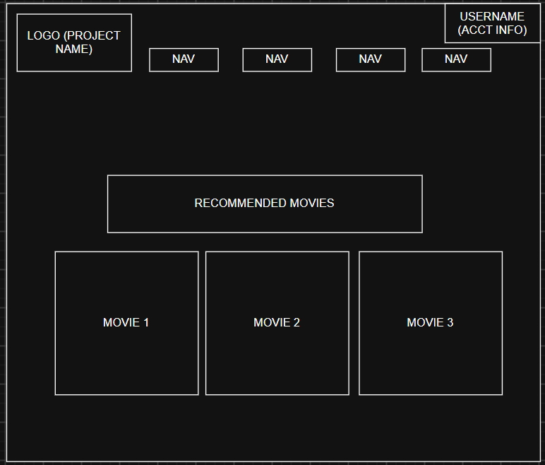
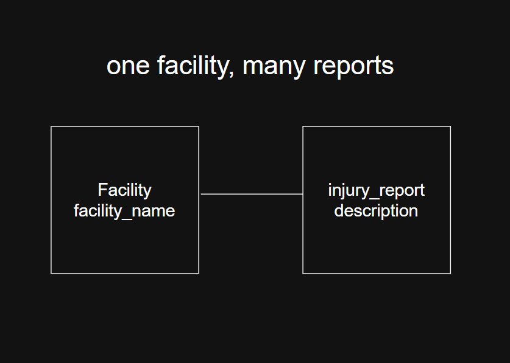

# My CS256 project

- Project name and brand: TBD (Movie Explorer for Users)

- Intended user and one useful task: Movie enthusiests, to help advertise movies

- Three screens and the path between them: Home Page, Forum Page, Submission Page, Blog Page


- Colors, typography, and why they support the user: red, black, and white. These colors create a movie-style design and make the website easy to read.

- Two related lecture tables and the primary/foreign keys: 
    movies (movie_id VARCHAR(100) PRIMARY KEY);
    reviews (review_id VARCHAR(100) PRIMARY KEY, movie_id FOREIGN KEY);

- Fields the browser will collect/display (and fields it must not expose): Users can enter movie searches, ratings, and reviews. The website displays movie titles, genres, ratings, and reviews. It must not expose passwords, private user information, or API keys.

- One reporting question answered by a join/aggregate: What movies have the highest average user rating? (use tables movies, reviews)

- Smallest working create/read/update/delete workflow: Users can add, view, edit, and delete movie reviews.

- Scope I am deliberately saving for later: I will save user accounts, movie trailers, advanced recommendations, and an admin dashboard for later.

Attach a wireframe with labels, empty results, errors, success, and delete confirmation.

## Weekly progress note

Milestone: M01 / Date:

1. What works (file or screenshot): 
2. One result I can explain: The 2 page sketches for website UI. (First page is forum page, second page is Home page)
3. What is blocked: No Blockers at the moment
4. My next action: Create a Skeleton.md and plan more of the workflow
5. AI tools used and how I checked/changed the output, or “none”: Codex, Copilot

S Corp observations
Task for Employee- Employees are tasked with filling out a forum (Report an Injury)
Task for Manager- Managers are tasked with filter claims and interpreting data (Manager Dashboard)

### M01 Project Proposal and Page Sketch

**AJ Scialpi**

## Project Proposal

My project will be a **Movie Database website** designed to help users search for and view organized information about movies. The primary users will be people who enjoy watching movies and want an easier way to determine what movies match their interests, where they can watch them, and basic information about each film.

The main task of the website will be allowing users to **search and browse movies using different criteria**. A user could search for a specific movie and view its genre, content rating, director, release date, user rating or popularity score, and streaming availability. Users could also browse movies by genre, director, streaming service, or release date. The website would act as a user-friendly interface for the relational movie database I am creating.

Several related database tables would likely be needed. A `Movies` table would contain the main information for each movie, including its title, release date, and content rating. A `Genres` table would contain available movie genres, while a connecting table such as `MovieGenres` would allow one movie to belong to multiple genres. A `Directors` table would contain information about directors and connect directors to their movies. A `StreamingServices` table would contain services such as Netflix, Hulu, or Disney+, while a `MovieStreaming` table would identify which movies are available on each service. Additional tables could include `Theaters`, `Showings`, and movie rating or popularity information.

The **minimum version** of my project will focus on the most important movie-searching features. Users will be able to view a list of movies, search for a movie by title, view information about an individual movie, and filter movies by genre. The movie detail page will display information such as the title, director, genre, release date, content rating, popularity or user rating, and available streaming services. Normal users will have read-only access, meaning they can search and view information but cannot modify the database.

One feature I will **save for later** is theater and showtime functionality. Eventually, users could select a movie and see which theaters in a particular city are currently showing it. This feature would require additional theater, location, and showing data, so I would rather implement it after the core movie searching and browsing features are working correctly.

---

## Page Mockup

### Movie Database – Home / Browse Page

```text\
+------------------------------------------------------------------+
|  MOVIE DATABASE NAME              Home | Movies | Genres | Search|
+------------------------------------------------------------------+

                   Find Your Next Movie

             [ Search movies by title... ] [ Search ]

--------------------------------------------------------------------

 Browse by Genre:

 [ Action ] [ Comedy ] [ Drama ] [ Horror ] [ Sci-Fi ] [ More ]

--------------------------------------------------------------------

 Popular / Recent Movies

 +----------------+  +----------------+  +----------------+
 |                |  |                |  |                |
 |  Movie Poster  |  |  Movie Poster  |  |  Movie Poster  |
 |                |  |                |  |                |
 | Movie Title    |  | Movie Title    |  | Movie Title    |
 | Genre          |  | Genre          |  | Genre          |
 | Rating         |  | Rating         |  | Rating         |
 | [View Details] |  | [View Details] |  | [View Details] |
 +----------------+  +----------------+  +----------------+

--------------------------------------------------------------------
```

### Example Movie Detail Page

```text
Movies > Interstellar

+------------------+--------------------------------------+
|                  |  Interstellar                        |
|   Movie Poster   |                                      |
|                  |  Director: Christopher Nolan         |
|                  |  Genre: Sci-Fi / Drama               |
|                  |  Release Year: 2014                  |
|                  |  Content Rating: PG-13               |
|                  |  Rating: 8.7/10                      |
|                  |                                      |
|                  |  Available On:                       |
|                  |  Streaming Service                   |
+------------------+--------------------------------------+
```

### Empty State

If a user's search does not return any movies:

```text
No movies found.

I couldn't find a movie matching your search.
Try another title or browse by genre.

[ Browse All Movies ]
```

### Error State

If the database or page cannot load:

```text
Something went wrong.

Movie information could not be loaded.
Please try again.

[ Try Again ]
```

### Brand Note

I want the Movie Database to use a **modern streaming-service-inspired design**. The interface will use a darker background with simple cards, movie posters, clear navigation, and easy-to-read text. My goal is to make searching and browsing movies feel similar to using a modern entertainment application while keeping the website simple and easy to navigate.

---

## Next Action

My next action will be to determine exactly which database tables and relationships are required for the minimum version of the website. After identifying those relationships, I can create the basic navigation and begin designing the movie search, movie listing, and movie detail pages.

## Question About the Lecture Database

When designing my website, should I build the pages around the database tables exactly as they currently exist, or is it acceptable for one webpage to combine information from several related tables using joins?

For example, the movie detail page would need information from `Movies`, `Genres`, `Directors`, and `StreamingServices` on the same page.

---Made with the assistance of ChatGPT